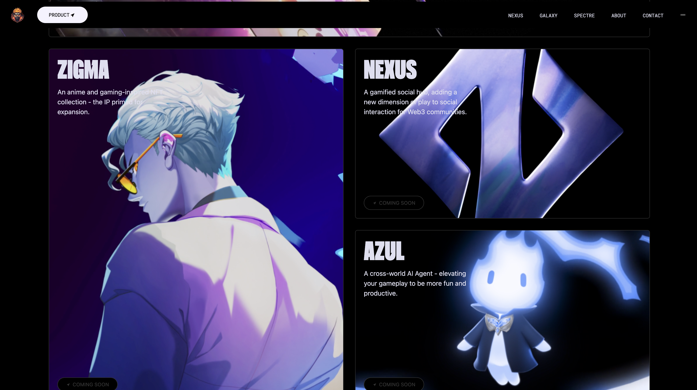
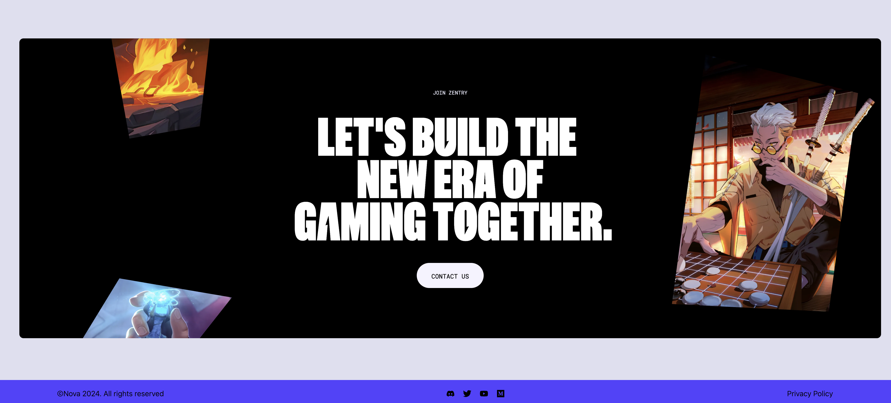

# 🎮 Metaverse Game Landing – React + Vite + Tailwind + GSAP

This project is a **metaverse gaming landing page** built with **React**, **Vite**, **Tailwind CSS**, and **GSAP** for animations.  
It was my first serious React project where I focused on building a visually rich, animated hero section and smooth scrolling experience.

The UI is inspired by modern gaming/metaverse websites with bold typography, full-screen hero video/image, and interactive sections.

---

## 🌟 Preview





---

## 🌐 Live Demo

You can view the live version on netlify:

**Live Demo:**  
*(https://future-zentry.netlify.app/#about)*

---

## 🎯 Goals of the Project

- Practice **React** component structure in a real project
- Learn how to set up a project using **Vite**
- Build a **fully responsive** landing page with **Tailwind CSS**
- Use **GSAP** to create smooth entrance and scroll animations
- Experiment with “hero video + big headline” gaming aesthetic

---

## ✨ Main Features

- 🖼️ Fullscreen **hero section** with large “REDEFINE / GAMING” typography  
- 🎥 Background **video / image overlay** for cinematic feel  
- ⚡ Smooth **GSAP animations** for headings, buttons, and sections  
- 📱 Fully responsive layout using **Tailwind CSS**  
- 🧱 Component-based structure with reusable sections (Navbar, Hero, Sections, Footer)  
- 🚀 Fast dev environment using **Vite**

---

## 🛠️ Tech Stack

- **React**
- **Vite**
- **Tailwind CSS**
- **GSAP (GreenSock Animation Platform)**
- JavaScript / JSX

---

## 📂 Folder Structure

```bash
meta-verse-game-react/
├── dist/                 # Build output (for deployment)
├── public/               # Static assets
├── src/
│   ├── components/               
│   ├── App.jsx
│   ├── App.css
│   ├── index.css
│   └── main.jsx
├── index.html
├── package.json
├── package-lock.json
├── postcss.config.js
├── tailwind.config.js
├── vite.config.js
├── eslint.config.js
└── README.md
```

## 🚀 Getting Started

Clone the repository:
```bash
git clone https://github.com/samuadda/meta-verse-game-react.git
cd meta-verse-game-react
```

Install dependencies:
```bash
npm install
```

Run the development server:
``` bash
npm run dev
```

Build for production:
```bash
npm run build
```

Preview production build:
```bash
npm run preview
```

## 💡 What This Project Shows About Me

- Ability to set up and configure a modern React + Vite + Tailwind stack

- Comfort working with animations (GSAP) and complex hero sections

- Focus on visual quality and layout—especially relevant for SaaS / marketing sites

- Good understanding of responsive design and component-based architecture

📬 Contact

Twitter(X) : [@samuadda](https://x.com/samuadda)

LinkedIn: [Saddiq Musa](https://www.linkedin.com/in/saddiq-daut/)

This project is part of my journey from static HTML/CSS templates into fully dynamic, animated React front-ends—before moving on to building SaaS products like Bilfora.

